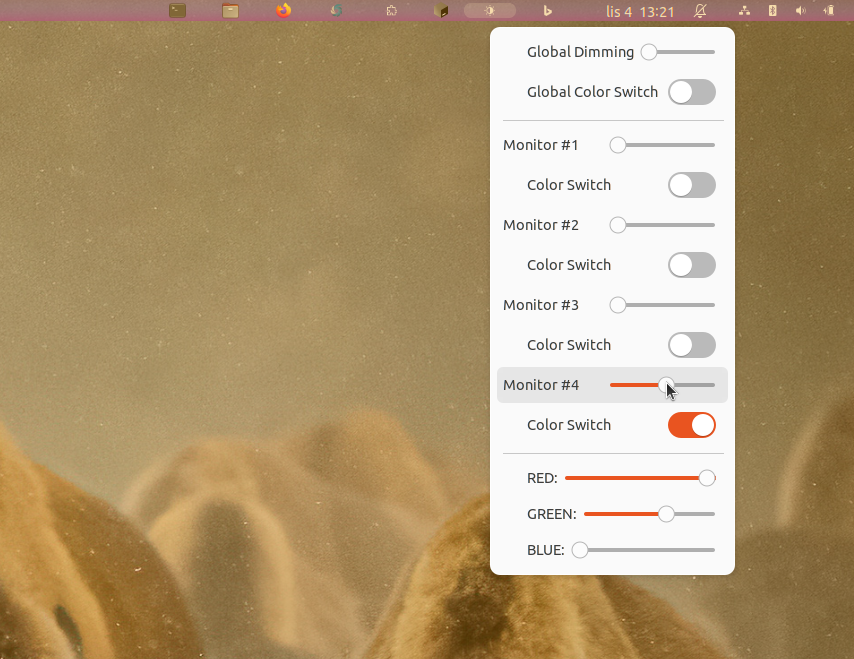

# VividShade
**VividShade: Multi-Monitor RGB Dimming Control**

Multimonitor dimming overlay with RGB regulation: extension adds a button with a light bulb icon to your panel. Clicking this button reveals individual sliders for each connected monitor, allowing you to adjust the dimming level. Additionally, you can toggle the color of the dimming effect and customize it using RGB sliders located at the bottom of the menu. Tested with Ubuntu 22.04.3 LTS and GNOME Shell 42.9.

